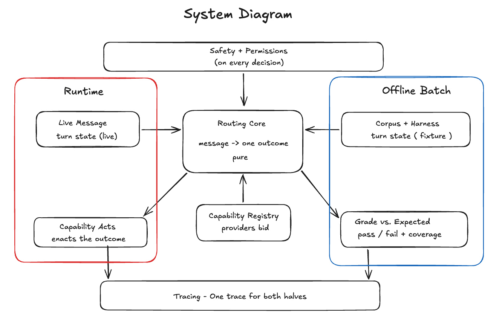
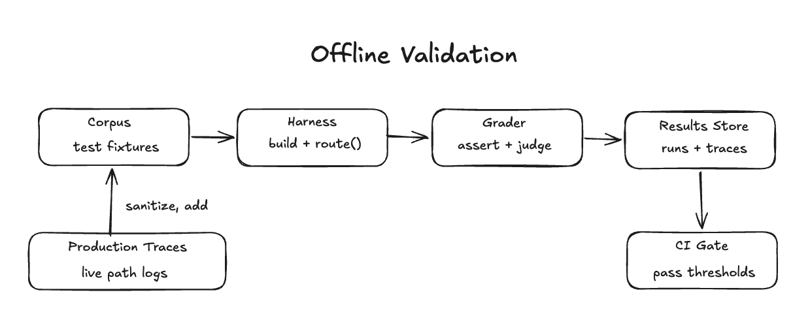

# Monty

## Context & Scope

Routing these messages is hard for a few reasons. Contractors don't talk in keywords.
It has to feel like a different experience than Alexa or Siri, a free-flowing conversation
without trigger words. A message often carries more than one intent **"did John get back on that bid,
and what's my margin if granite prices went up?."**

Some messages are harmless searches while others send messages or write to a sheet.
Trust is the product and a confident wrong answer is worse than asking for clarification.

## Goals & Non-Goals

Goals:

- Safe, deterministic routing
- Person scoped safety (only touch what they're permitted to)
- Trust, surface ambiguity honestly
- Resolve in 1-2 turns
- Handle compound & follow-up messages
- Offline validation at scale, routing across the whole question space
- To be the opposite of: long chats, lots of text, something that has a
  learning curve to use

Non-Goals:

- **A Chatbot.** This isn't designed for long conversations or deep research.
  It's "What info about my business do I need right now?"
- **User-facing model selection.** Adds cognitive load for zero benefit and
  risks alienating a non-technical user.
- A replacement for their accountant/judgement/co-worker. The product is
  an extension, another tool in their toolbelt.

## Architectural Design

### Runtime Cascade

A text arrives as raw input and before any decision can be made, it passes through
three stages that build it into a richer object.

1. The gateway situates the message. Who am I and where am I? Key information:

- The person it came from
- The platform it was sent from
- Whether it belongs to a group thread
- Whether it's a reply to one of Monty's own messages
  If it replies and if the message is part of a reply in a workflow Monty already owns,
  then it can be marked as a continuation of that conversation rather than a fresh start.

2. We load the memory that this turn needs deterministically. Recent turns in the thread,
3. like that bid or send it to her, can be resolved against what came before this current turn
4. and the person's own memory. Pinned facts, aliases, projects, contacts, etc.
5. We also check if there are any attachments and register them on this turn.

Third we narrow the matching of this message against that memory to resolve what
the words point to. Does "Duluth" map to a known project? Is it an address?
Narrowing figures out what the message refers to which project, which earlier turn
so the router has resolved references to act on. Each resolved reference carries
a confidence score and a source. We also set signals here, whether it's an identity
question, is smart reply allowed, whether anything triggers prompt blocking.
These are references and signals but not decisions.

The output of all three stages is the turn state, the original message plus every resolved reference.
That object is what the routing core arbitrates over, where providers bid
and only one outcome is chosen.

### Provider Model

The provider contract has two halves:

1. A static declaration that lives in the registry (read/write/private etc)
2. A per-turn bid

A capability declares what it can do, like read or write data, or if it needs
special information in the contract, like Project Accounting needs a project. If data coming to the
provider model doesn't have a project attached to it, then the bid that the
Project Accounting provider places is going to be low.

The arbitration gate is important ...even if the arbitrator chose provider that
has a permission/action the turn requires it still gets held for confirmation.

### Offline Validation

Offline validation runs a corpus of test cases through a harness against their
expected behavior measuring the router and catching regressions. When a case fails,
a human reads the failure and iterates on the routing logic. The corpus is a
collection of cases with known correct outcomes authored to cover tricky routing
situations, plus real turns harvested over time to widen coverage. Each is graded
pass/fail against its expected outcome.

Did it call the right tool?
Did it avoid the dangerous tool?
Did it say the right thing?

`route()` is a pure function, it takes a turn state and returns an outcome.
Live the caller is the inbound message and offline the caller is the test harness,
building a turn state from a stored test fixture.

## Safety & Permissions

A wrong silent route is an expensive, hard-to-undo failure, so the system checks
permission and reversibility before it acts. When it can't resolve a turn confidently,
it would rather clarify or abstain than guess. Safety is enforced by the arbitration gates in order.

The permission gate comes first because identity scopes everything. If the turn
needs a permission the person doesn't have, the arbitrator won't choose that capability
no matter how confident its bid. That's person-scoped safety.

The smart reply guard is next. On a private lookup or a provider-owned workflow,
the generalist-composer is dropped so a specialist handles it rather than firing off a quick answer.

Finally the action policy is last. Reversible reads run immediately but writes
and sends are held for confirmation before anything executes.

- Permission gate (is this person allowed?)
- Smart reply guard (should the generalist step aside?)
- Action policy (is this safe to execute or hold for approval?)

## Alternatives Considered

I first considered an intent router with fixed classification buckets, bid lookup,
price check, job status etc. I thought that would help prefetch the data before the agent runs.
It's the naive solution and it breaks on real messages. If a contractor asks "did John get back on that bid,
and what's my margin if granite went up?", that's one message two intents. A single bucket router
either misclassifies or reintroduces the nondeterminism I was trying to remove. It's also stateless
so a follow up message like "send that to him" would have no coreference. Each new capability means a new bucket, classifier
path, a new prefetch config it would be too cumbersome to maintain.

Letting capabilities bid & arbitration decide is the cleaner solution. The router holds no per-capability logic so
compound intent and follow up turns operate from the same mechanism.

## Scope & Phasing

If I only had a couple of days, I'd build one thread through the whole system rather
than any one full part. A real message becomes a turn state, only a handful of capabilities,
arbitration picks one outcome, and a handful of corpus fixtures grade it. That touches every layer
so it becomes easier to widen it later through repetition of adding more capabilities of the same shape.
