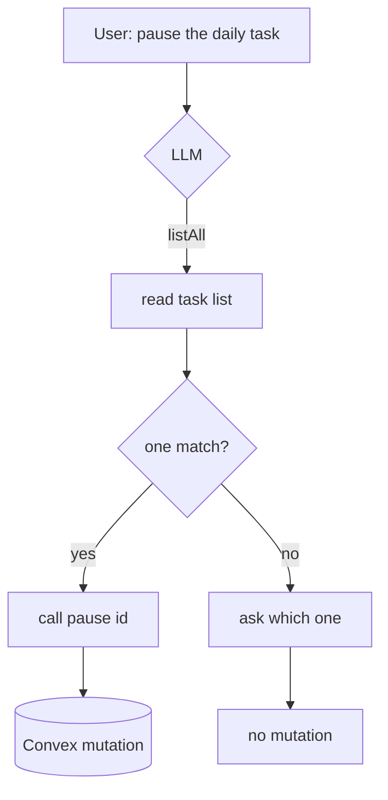

# FOR ETHAN - The Learning Log

A magazine-style companion to the codebase.
This first issue covers **PR 3: the write surfaces** (pause / resume / enqueue), because that is where the dashboard stops just _reading_ the footage vault and starts _editing the reel_.

---

## 1. The Story So Far

The dashboard is a chat window where an admin talks to "Monty."
Monty can already _read_ the backend (one query tool, `getAggregateStats`).
PR 3 gives Monty _hands_: it can now pause a scheduled task, resume it, and queue a direct message.

Writing is scarier than reading.
A bad read shows a wrong number; a bad write changes real state.
So the whole PR is really about **making writes safe without making them heavy**.

---

## 2. Cast & Crew (Architecture)

Think of one message as a signal chain on a soundboard:

- **The LLM** decides _which_ tool to call and _with what_ (the performer).
- **`validate`** is the input gain stage - untyped JSON in, typed args out, or it clips (throws).
- **`run`** is the one patch cable to Convex (the only place a signal leaves the board).
- **The loop** feeds each tool's _result_ back into the next take, then streams the final answer.

New this PR: the **registry** used to hold one tool of one shape.
It now holds tools of _different_ shapes (pause returns a task doc, enqueue returns an id).
A tiny `register(tag, tool)` step at the edge erases each tool's specific types into a uniform `RegisteredTool`, so the loop can dispatch any of them by name.

Two _new_ surfaces sit outside the chat, wired straight to Convex:

- **Task Control card** (`TaskControl`) - the reference pattern for an optimistic mutation.
- **Direct Message composer** (`DirectMessageComposer`) - the reference pattern for a _reversible_ mutation (the undo window).

---

## 3. Behind the Scenes (Decisions)

**Why a `register()` helper instead of one big `switch`?**
A `Tool<PauseArgs, TaskDef>` is _not_ assignable to a `Tool<unknown, unknown>` - function parameters are contravariant, so the shapes don't collapse into one type.
Rather than an `any` cast (banned) or a growing hand-written switch, `register` closes over each tool's own typed `validate`+`run` at the point of registration, where the types still line up, and hands back a type-erased record everyone can append to.
Adding a tool later is one line, no edits to the dispatcher.

**Why three thin safety layers, not one fat validator?**
`validate` only proves the args are _well-formed_ (a non-empty id string, a known channel).
It deliberately does not resolve names or check existence - that would bloat the trust boundary and duplicate what Convex already enforces.
The other two layers live where they belong: **confirm-on-ambiguity** is a _system-prompt rule_ (the model's job), and the **named acknowledgment** falls out for free because `run` returns the patched doc, so "Paused Daily Project Accounting" makes a wrong target obvious in the reply.

**Why defer the send instead of a confirm dialog?**
A modal interrupts; an undo window doesn't.
`scheduleWithUndo` is a five-line wrapper over `setTimeout` - the send fires after 5s unless an "Undo" pill clears the timer first.
The Convex call never happens during the window, so undo is truly free (nothing to roll back).

---

## 4. Bloopers (Bugs & Fixes)

- **`void` in a union is illegal.** Typing `onToggle: () => Promise<unknown> | void` tripped `no-invalid-void-type`. Fix: type it `=> unknown` and normalize in the component with `await Promise.resolve(onToggle(next))` - which both awaits a returned mutation promise and no-ops a plain return.
- **Writing a ref during render.** `pendingRef.current = pending` on every render is a lint error (refs are for effects/handlers, not render). Fix: sync it in a `useEffect([pending])`.
- **A guard that's "always truthy."** `const first = groups[0]` is typed non-optional, so `if (first)` looked dead to the linter. Fix: `groups.at(0)` returns `T | undefined`, making the guard meaningful.

---

## 5. Director's Commentary

**Test the wiring, not the actor's judgment.**
The "ambiguous task name -> ask instead of write" behavior is the _model's_ decision, driven by a prompt rule.
Trying to assert that against a real LLM would be a flaky, expensive test of someone else's brain.
Instead, the integration test _scripts_ the LLM and only checks the flow supports both branches: on the pause path a mutation fires; on the ask path **no** mutation fires.

```text
// The scripted LLM chooses to ask, not to pause:
decideTool: scriptDecideTool([
  { id: "c1", name: "listAll", args: {} },  // it looked...
  null,                                     // ...then answered instead of calling pause
]),
// Assertion: the write never happened.
expect(mutation).not.toHaveBeenCalled();
```



The lesson that generalizes: when a system has a non-deterministic component, draw your test boundary _around_ it - assert the deterministic wiring on both sides, and let a cheap unit test cover the rule that guides the non-deterministic part.
