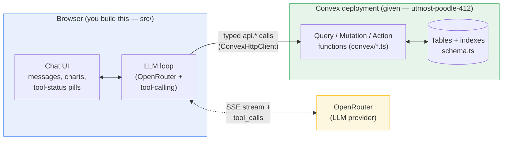
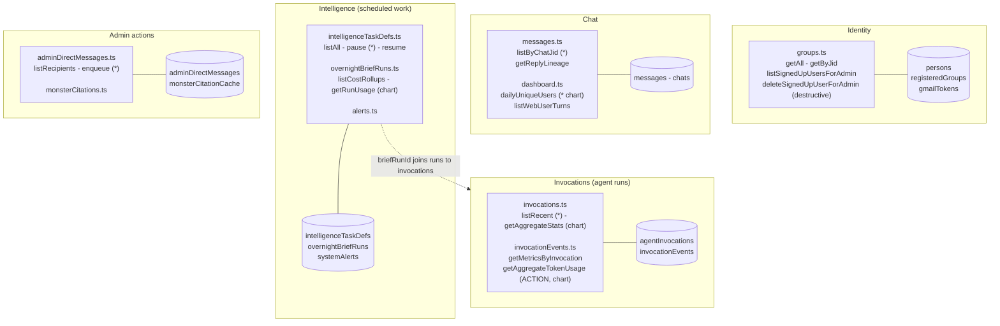
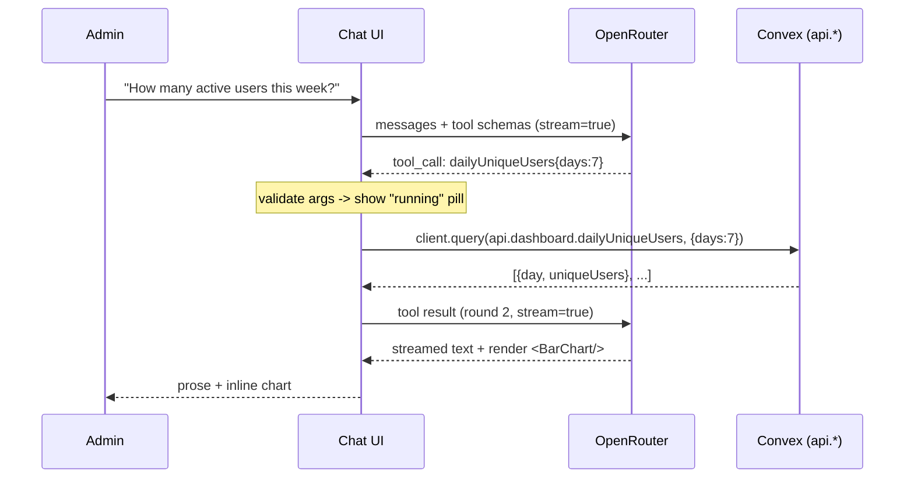

# Repo Tour & Brief Gap Analysis

> Reconnaissance notes for the PlanMonster conversational-dashboard take-home.
> The repo is **backend-complete, frontend-empty**: the `convex/` dir + live
> deployment is the given; `src/` is a hello-world you replace.

## Part 1 — Brief requirements → what's in the repo

**Verdict: you have everything you need to start. Every gap is the work itself
(the frontend), not a missing input.**

| Brief requirement                             | Status        | Where it lives / what's missing                                         |
| --------------------------------------------- | ------------- | ----------------------------------------------------------------------- |
| **Must 1** — Chat interface                   | Build it      | `src/App.tsx` is a hello-world group list                               |
| **Must 2** — LLM w/ tool-calling              | Build it      | Key provided (`VITE_OPENROUTER_API_KEY` in `.env.local`)                |
| **Must 3** — ≥5 tools on real `api.*` queries | Backend ready | 25+ functions across 10 files, all verified live                        |
| **Must 4** — ≥1 inline chart                  | Build it      | No chart lib installed (Recharts in Phase 2)                            |
| **Must 5** — Streaming responses              | Build it      | OpenRouter supports SSE                                                 |
| **Must 6** — Tool-call status indicators      | Build it      | Pure UI state                                                           |
| **Should 7** — Reply lineage / context        | Backend ready | `messages.getReplyLineage` walks `replyToMsgId`                         |
| **Should 8** — Clarification on ambiguity     | Build it      | Prompt/UX design                                                        |
| **Should 9** — Error handling                 | Build it      | try/catch in the loop                                                   |
| **Should 10** — ≥1 mutation wired             | Backend ready | `intelligenceTaskDefs.pause/resume`, `adminDirectMessages.enqueue`      |
| **Nice 11** — Multiple chart types            | Data supports | bar (daily users), table (invocations), line (token usage)              |
| **Nice 12** — Message history drill-in        | Backend ready | `messages.listByChatJid`                                                |
| **Nice 13** — Cost breakdown by Go Deep run   | Partial       | `getRunUsage` works; `listCostRollups` returns zeroed usage (see below) |
| **Nice 14** — DESIGN.md                       | Write it      | —                                                                       |

### Verified against the LIVE deployment (not just the source)

Probed `https://utmost-poodle-412.convex.cloud` directly:

- **Reachable.** `groups.getAll` → 5 seeded groups (Maya Patel/web, Diego
  Ramirez/whatsapp, …).
- The two `.action()` functions work — `getAggregateTokenUsage` →
  `{input: 157400, output: 65200, total: 222600}`.
- `invocations.listRecent` → **39 invocations**: 24 succeeded, 7 failed, 4 pending,
  4 running; roles simple/child/parent/composer. Good for the "failed runs" +
  aggregate-stats tools.
- `intelligenceTaskDefs.listAll` → **"Daily Project Accounting"** + **"Weekly Lead
  Revival"**, both active. (The brief's "pause the Daily Project Accounting task"
  example works as-is.)
- `dailyUniqueUsers` has nonzero days (Jun 18/19/22/24) — real bars to render.

### Key insight: checked-in source ≠ deployed backend

Two source quirks that _should_ break didn't on the live deployment:

1. The `.action()` token functions use `ctx.db` directly, which a normal Convex
   _action_ doesn't have access to — yet they return real data.
2. `dashboard.dailyUniqueUsers` references a bare `lane` variable that isn't declared
   in scope (`dashboard.ts:124`), which should be a ReferenceError — yet the live
   call succeeds.

**Takeaway: treat `API.md` + the live deployment as the contract, not the source
line-by-line.** Read the source for _shape and intent_; call the deployment for
_truth_.

### Two gotchas to design around (not blockers)

1. **`dailyUniqueUsers` with `lane:"web"` returns all zeros** even though unfiltered
   returns data — seeded inbound messages don't carry a matching `laneKey`. For the
   chart demo, call it without `lane`.
2. **`overnightBriefRuns.listCostRollups` returns zeroed usage fields**
   (`overnightBriefRuns.ts:50-64` hardcode `zeroUsage()`). Only
   `getRunUsage(briefRunId)` computes real per-run cost. So Nice #13 = list runs with
   `listCostRollups`, then fan out to `getRunUsage` per run.

---

## Part 2 — Repo tour & boundaries

### Three boundaries

Three boundaries to keep clean (the brief explicitly grades the first):

1. **LLM ↔ tools** — the LLM emits a tool name + JSON args; _your_ code validates
   them and calls the matching `api.*` function. This is where hallucinated args get
   caught.
2. **App ↔ Convex** — always through the **typed `api`** (`convex/_generated/api`).
   Never `anyApi`. Compile-time arg/return checking.
3. **App ↔ OpenRouter** — streaming chat completions with `tools`.

### Mental mapping from Drizzle / Postgres

- **`schema.ts` ≈ a Drizzle schema** — `defineTable` ≈ `pgTable`, and
  `.index("by_chatJid_and_timestamp", [...])` is a _named compound index_ you must
  reference explicitly later. No query planner picks indexes for you.
- **`query`/`mutation` ≈ typed server-action RPC endpoints.** A `query` is a read
  (auto-cached + reactive); a `mutation` is a transactional write. No SQL — you call
  `ctx.db.query("table").withIndex(...)`, and **choosing the index is mandatory and
  manual** (e.g. `messages.ts:13`).
- **`action` ≈ the Edge-function paradigm.** Unlike a `query`, an action can do
  non-deterministic things (`fetch`, hit OpenRouter, stream). Normally it has no
  direct DB access and calls `ctx.runQuery(...)` instead. (This backend bends that
  rule — see the source-vs-deployed note.)

### Backend domain map

`(*)` = strong first tool · `chart` = chart-friendly · `ACTION` = must call
`.action()` · `destructive` = cascades deletes.

### The 5–6 functions to wire first

| Tool                  | Function                                       | Why it's a strong first pick                                          |
| --------------------- | ---------------------------------------------- | --------------------------------------------------------------------- |
| Daily active users    | `dashboard.dailyUniqueUsers`                   | One call → a bar chart. Hits Must #4.                                 |
| Token usage           | `invocationEvents.getAggregateTokenUsage`      | Exercises the **action** path + a breakdown chart.                    |
| Recent/failed runs    | `invocations.listRecent` + `getAggregateStats` | Filterable table + KPIs; 39 rows, mixed statuses.                     |
| A user's conversation | `messages.listByChatJid` (+ `getReplyLineage`) | "What has Maya been talking about" + reply context (Should #7).       |
| Pause a task          | `intelligenceTaskDefs.pause`                   | The one **mutation** (Should #10); "Daily Project Accounting" exists. |
| Signed-up users       | `groups.listSignedUpUsersForAdmin`             | Clean table; names/emails/Gmail status.                               |

### Why the backend is shaped this way

- **Functions return view-models, not raw rows.** `dashboard.listWebUserTurns`
  (`dashboard.ts:7`) joins a user message to its assistant reply and flattens it into
  one object — exactly what makes these good LLM tools (clean self-describing JSON,
  no foreign keys to chase).
- **The `agentInvocations` ↔ `invocationEvents` split is the core domain model.** An
  _invocation_ is one agent run (status, duration); _events_ are fine-grained
  tool-calls / model-turns with per-event token counts. Aggregations roll events up.
  The `by_briefRunId` index is the join that lets Go Deep cost rollups gather all
  invocations of one scheduled brief.
- **`deleteSignedUpUserForAdmin` is the one genuinely destructive call**
  (`groups.ts:81`) — cascades deletes across groups + Gmail tokens. If wired as a
  tool, gate it behind explicit confirmation.

### The conversational loop (heart of Must #2)

"Browser-direct" still means a **multi-turn loop**, not one request: usually 2
round-trips to OpenRouter per user message (tool decision, then synthesis). All of it
originates from the local browser; the key sits in `.env.local`.

---

## Architecture decisions (locked)

- **LLM runs browser-direct.** `VITE_`-prefixed env vars get inlined into the JS
  bundle, so the key is only "exposed" if you deploy publicly. Local-dev-only →
  non-issue. DESIGN.md gets one line: _"browser-direct; in prod the call would move
  to a Convex action with the key in `npx convex env set`."_
- **Tool-calling boundary** = a hand-written tool registry (`{name, description,
parameters, validate, run}`); the LLM never touches `api` directly.
- **shadcn for the final UI**, plain CSS for the Phase-1 steel thread.
- **Stay in this repo** (already README "Option B" done) — don't scaffold a new
  `react-vite-shadcn` template; run `npx shadcn init` in-place in Phase 2.
